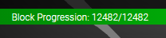

Block Progression

The Block Progression area shows you the latest block that you've downloaded 
from the network, and the current block height. If they are equal, your wallet 
is synchronised with the network.

If you cannot get your wallet to synchronise properly, visit the [XAYA 
forums](https://forum.xaya.io/) and post in the [Support 
forum](https://forum.xaya.io/forum/16-support/).

