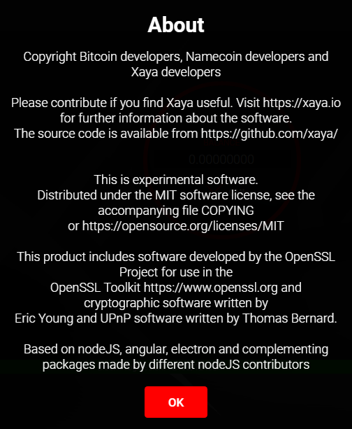

# About

The About dialog has some basic information about the wallet, including license 
and copyright information.

XAYA is open source. Source code is available at the [XAYA Github respository 
here](https://github.com/xaya/).

XAYA is experimental software [distributed under the MIT license available 
here](https://opensource.org/licenses/MIT).

