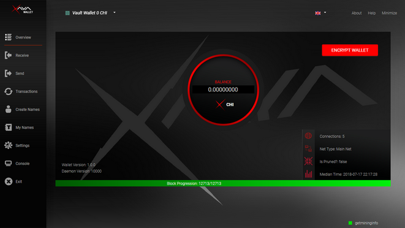
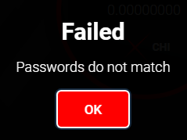
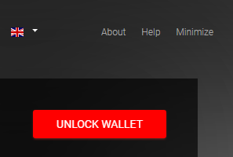
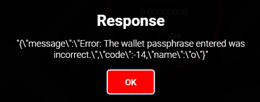

# Encrypt Vault Wallet

It is STRONGLY recommended that you encrypt your vault wallet. This will help to 
keep the CHI and blockchain assets in it secure.

You must back up your vault wallet after you encrypt it and ensure that you have 
stored your password for it safely. Failure to do so could result in lost CHI 
and lost blockchain assets.

Ideally, you should start with a 0 balance in your vault wallet and have no 
blockchain assets or names stored in it. The purpose here is to test your newly 
encrypted wallet with zero risk.

The following shows how to encrypt your wallet in a conservative (paranoid) 
manner that seeks to eliminate potential errors.

1. If you have any coins in your vault wallet, send them all to your game 
wallet. Check the "Subtract fee from amount?" checkbox. See [here for how to 
send coins](send.md). Similar for other blockchain assets, i.e. names. Transfer 
any names to your game wallet. See [here for how to transfer 
names](transfer_a_name.md).

2. Your empty vault wallet should look like this:  
   
  
 

3. Decide on a password that you would like to use, and write it down or store 
it in a safe location, ideally in a password manager.

4. Click ENCRYPT.

5. Enter your password into the password field and click the Encrypt button. 
Ideally, you should copy your password from your password manager. It is 
possible that if you type your password, you could mistype it and that you could 
mistype it when you confirm your password. Copying your password from your 
password manager is the safest way to ensure that you enter your password 
correctly.  
   
  
 

6. Confirm your password by entering it in again and clicking the Encrypt 
button. Pay attention to what happens next.  
  
  

7. If your passwords don't match, you'll see this error message. Start again at 
step 5.  
   
  
 

8. If your passwords match, you'll see this message but only briefly. The wallet 
software will automatically close.  
   
  
 

9. Restart the wallet software.

10. Ensure that the vault wallet is selected. See [here for how to select the 
vault wallet](wallets.md).

11. Test your new password by clicking UNLOCK WALLET in the upper-right corner 
of the wallet on the [Overview screen](overview.md) and entering your password. 
 
   
  
 

12. If your wallet was successfully unlocked, you will see a message in the 
upper-right corner of the wallet on the [Overview screen](overview.md).  
   
  
 

13. If you did not enter your password correctly, you will see a message similar 
to the figure below.  
   
  
 

14. If you entered the wrong password, start again at step 11. If the error 
persists, then you've failed to properly encrypt your wallet with a password 
that you can reliably enter. (This is why your wallet should be empty as per the 
notice above in step 1.) See [Get a New Wallet](get_a_new_wallet.md) for 
information on how to get a new vault wallet to encrypt. After that, start over 
at step 1.

