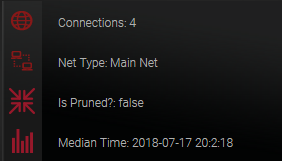

# Network Info

The Network Info area displays basic information about the blockchain.

Connections shows how many active connections you have to other XAYA nodes 
around the world.

Net Type tells you whether you are on mainnet (this is where you play games) or 
on testnet (this is where testing is done).

Is Pruned? tells you whether you're running with the full blockchain (false) or 
with a shorter version (true).

Median Time is just the time. It updates periodically, and not in real time.

